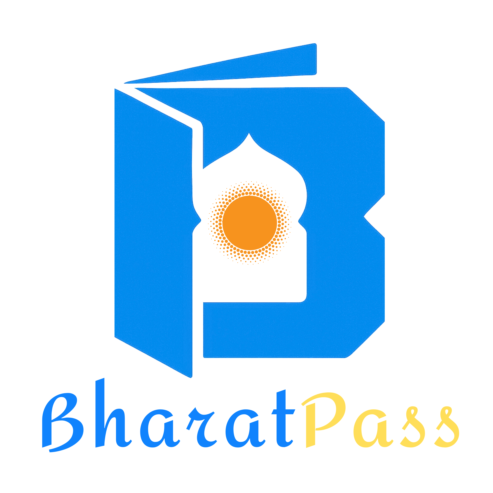
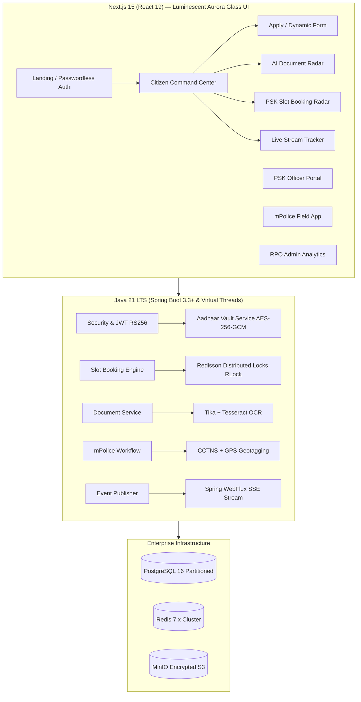

<div align="center">

  

  # 🇮🇳 BHARAT PASS
  ### Next-Generation National Passport Issuance & Verification Infrastructure
  
  <p align="center">
    <strong>Modernizing, scaling, and securing the Indian Passport Seva ecosystem.</strong><br />
    <em>Powered by Java 21 LTS (Virtual Threads), Spring Boot 3.3, Next.js 15 (React 19), Redisson Distributed Locks, and UIDAI Data Vault AES-256-GCM.</em>
  </p>

  <p align="center">
    <a href="#-key-architectural-pillars">Pillars</a> •
    <a href="#-bento-grid-ui-architecture">Bento Grid UI</a> •
    <a href="#-interactive-stakeholder-portals">Portals</a> •
    <a href="#-quick-start-guide">Quick Start</a> •
    <a href="#-security--compliance">Security</a>
  </p>

  <p align="center">
    
    
    
    
    
    
  </p>
</div>

---

## 🌟 Key Architectural Pillars

### 1. 🛡️ Passwordless Aadhaar e-KYC & Data Vault Subsystem
- **UIDAI Auth API v2.5 Simulation**: Passwordless OTP generation, validation, and digitally signed XML e-KYC payload processing.
- **UIDAI Data Vault Compliance**: Raw Aadhaar numbers are **never** stored in relational tables. All entries are encrypted with **AES-256-GCM** in an isolated vault service, generating internal immutable `UUIDv4` reference keys for application contexts with masked outputs (`•••• •••• 9012`).

### 2. ⚡ High-Concurrency Slot Booking Engine (Redisson Locks)
- **Zero Double-Booking Guarantee**: Resolves race conditions during morning peak slot releases (50,000+ simultaneous requests).
- **Token Bucket Rate Limiter** & **Virtual Waiting Room**.
- **Distributed Lease Locks** (`RLock.tryLock(waitSec, leaseSec)`) on slot inventory keys (`SLOT:{rpo_id}:{date}:{time_window}`) with a 5-minute checkout TTL.

### 3. 🧠 Dynamic Schema Engine & AI Document Pre-Verification
- Dynamic form state machine supporting *Fresh, Renewal, Tatkaal, Minor, Diplomatic, and Lost/Damaged* categories.
- Auto-fills demographic fields from e-KYC payload with cryptographic lock to prevent fraud.
- Integrated AI OCR pre-verification using `Apache Tika` & `Tesseract OCR` analyzing image blur/glare, resolution DPI, and cross-checking extracted text before PSK submission.

### 4. 📡 Real-Time mPolice Verification & Milestone SSE Stream
- Field officer portal with live GPS geo-tagging, digital checklist validation, and CCTNS background checks.
- Event-driven status pipeline via Spring WebFlux Server-Sent Events (SSE).
- End-to-End State Machine: `INITIATED → EKYC_VERIFIED → PSK_APPOINTMENT_COMPLETED → PVS_DISPATCHED → POLICE_VERIFIED → PRINTING_QUEUED → DISPATCHED_SPEED_POST → DELIVERED`.

---

## 🤖 Meet BharatBot — Built-In AI Assistance

<div align="center">
  
  <p><strong>BharatBot AI Intelligence Assistant</strong></p>
  <sub>Instant answers for SLA tracking, Tatkaal eligibility rules, biometric readiness checks, and slot release timers.</sub>
</div>

---

## 🍱 Bento Grid UI Architecture (Citizen Command Center)

```
┌────────────────────────────────────────────────────┬───────────────┐
│                                                    │               │
│  APPLICATION HERO WIDGET (Col 1-8, Row 1)          │  IDENTITY     │
│  ┌─ Luminescent Glass Card ──────────────┐         │  VAULT &      │
│  │ 🪪 Live SVG Biometric Passport Preview │         │  e-KYC STATUS │
│  │ ◉ 7-Stage Real-Time Progress Bar      │         │  (Col 9-12)   │
│  │ ⏱ SLA Guaranteed Delivery Countdown   │         │               │
│  └───────────────────────────────────────┘         │  Aadhaar: ✅  │
│                                                    │  DigiLocker:✅ │
│                                                    │  Biometric: 🔒│
├──────────────┬─────────────────┬───────────────────┤───────────────┤
│              │                 │                   │               │
│ APPOINTMENT  │ mPOLICE         │  AI DOCUMENT      │               │
│ RADAR        │ VERIFICATION    │  READINESS        │               │
│ (Col 1-4)    │ STREAM          │  HEALTHCHECK      │               │
│              │ (Col 5-8)       │  (Col 9-12)       │               │
│ PSK Heatmap  │ Live Tracker    │  Score: 94/100    │               │
│ ◉ Book Now   │ 📍 GPS Status   │  🛡 0% Rejection  │               │
│              │ ✍ Digital Sign  │  ✅ Grade A Photo │               │
└──────────────┴─────────────────┴───────────────────┴───────────────┘
```

---

## 🏛️ System Architecture Flow



---

## 🎭 Interactive Stakeholder Portals

| Portal | Route | Description |
|---|---|---|
| 🔐 **Landing & Identity Gateway** | [`/`](http://localhost:3003/) | Passwordless Aadhaar OTP & Offline e-KYC login |
| 🪪 **Citizen Command Center** | [`/dashboard`](http://localhost:3003/dashboard) | 12-Column Bento Grid dashboard with live passport preview |
| 📝 **Apply for Passport** | [`/apply`](http://localhost:3003/apply) | 4-step dynamic multi-category application form |
| 🔍 **AI Document Ingestion Radar** | [`/documents`](http://localhost:3003/documents) | AI OCR quality scanning & blur/glare analysis |
| ⚡ **PSK Slot Radar** | [`/book-slot`](http://localhost:3003/book-slot) | Slot heatmap & Redisson 5-min lease booking engine |
| 📡 **Live Stream Tracker** | [`/track`](http://localhost:3003/track) | Real-time SSE milestone audit log & Speed Post |
| 👮 **PSK Officer Portal** | [`/officer`](http://localhost:3003/officer) | Counter A walk-in queue & biometric granting |
| 📍 **mPolice Field App** | [`/police`](http://localhost:3003/police) | GPS geo-tagged inspection & digital report signoff |
| 📊 **RPO Admin Analytics** | [`/admin`](http://localhost:3003/admin) | National throughput & slot capacity manager |

---

## 🚀 Quick Start Guide

### Prerequisites
- Node.js 20+ & npm
- Java 21 LTS & Maven 3.9+
- Docker & Docker Compose (Optional for full backend containerization)

### 1. Launch Infrastructure Stack (Postgres, Redis, MinIO)
```bash
docker-compose up -d
```

### 2. Run Backend Engine (Spring Boot 3.3+)
```bash
cd backend
mvn spring-boot:run
```
*Backend runs on `http://localhost:8080` with Project Loom virtual threads enabled.*

### 3. Run Frontend Application (Next.js 15)
```bash
cd frontend
npm install
npm run dev
```
*Open `http://localhost:3003` to access the portal in your browser.*

---

## 🔒 Security & UIDAI Compliance

<div align="center">
  
</div>

- **UIDAI Data Vault**: Isolated AES-256-GCM encryption with master key rotation.
- **Zero Raw PII Storage**: Application tables reference UUID keys only.
- **Distributed Concurrency**: Redisson lease locks prevent duplicate allocation under extreme traffic.
- **OWASP Top 10 Compliant**: Strict Jakarta Bean Validation, parameter sanitization, and stateless RS256 JWT tokens.

---

## ⚖️ Legal & Educational Disclaimer

> [!IMPORTANT]
> **Educational & Architectural Proof-of-Concept:**  
> **BharatPass (PassportSeva NextGen)** is an independent, open-source educational, technical demonstration, and research prototype. It is **not** affiliated with, endorsed by, or an official portal of the **Ministry of External Affairs (MEA)**, **UIDAI**, **Passport Seva (`passportindia.gov.in`)**, or the **Government of India**.
> 
> All simulation endpoints (such as UIDAI Auth v2.5 and Speed Post tracking) use synthetic, mocked data for architectural testing and performance benchmarking. No real Aadhaar or citizen PII is collected, processed, or transmitted.

---

<div align="center">
  <sub>Open-Source Architectural Proof-of-Concept • Modernizing Digital Public Infrastructure</sub>
</div>

